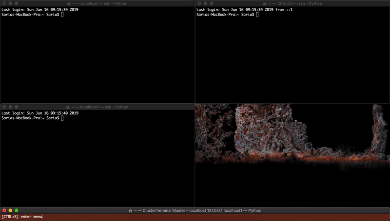

ClusterTerminal (`cterm`) forwards all keystrokes from a master window to multiple slave windows. Use `cterm` as a method for performing ad hoc tasks, not as a substitute for automation frameworks.

# Installation

    pip3 install cterm

ClusterTerminal uses the built-in Terminal application of macOS.

# Usage

The most common use case is controlling multiple SSH sessions simultaneously:

    cterm ssh host1 host2

## Tips

You might want to set up an alias for cluster ssh in your `~/.bash_profile`. For instance, `alias cssh="cterm ssh"`, and then call it using `cssh host1 host2`.

In an alias, you can save your normal settings, like `alias cssh="cterm --screen 2 ssh"` to change the default screen.

If you specify the same argument twice, the last instance is the one used. This is useful since you may want to overwrite part of your alias, but not all of it. For example, the following will use screen 1:

    cterm ssh host1 host2 --screen 2 --screen 1

# Limitations

The scripting methods of Terminal do not return the transparency of the window. Instead, they always 0 for the alpha component (completely opaque). Not only that, but you can't set the alpha value either (it remains 0 even when changed). Due to that, ClusterTerminal removes any transparency on the windows it spawns.
